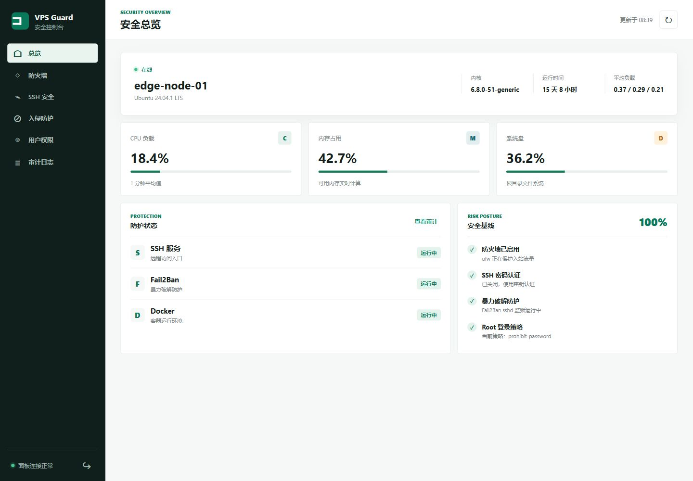

# VPS Guard 服务器安全面板

[](LICENSE)
[](https://www.python.org/)

VPS Guard 是一个原创实现的轻量、低依赖 Linux 服务器安全控制台，将主机状态、SSH、防火墙、Fail2Ban、用户权限和操作审计集中到一个本地 Web 面板。



## 功能概览

- 主机 CPU、内存、磁盘、负载和关键服务状态
- UFW / firewalld 防火墙状态与端口规则
- SSH 端口、密码认证、Root 登录和授权密钥检查
- Fail2Ban SSH 监狱、封禁 IP 和解除封禁
- 普通用户列表与账号锁定
- 所有面板变更的本机审计日志
- 零第三方运行时依赖，安装后由 systemd 托管

## 安全边界

- 面板默认监听 `127.0.0.1:8787`，不会自动开放公网端口
- 安装时生成随机访问令牌，长度为 256 bit
- 令牌只保存在当前浏览器会话，不写入前端代码
- 后端只允许执行白名单操作，不接受任意 Shell 命令
- 变更操作需要二次确认，记录到 `/var/log/vps-guard/audit.jsonl`
- 返回 CSP、禁止 iframe 嵌入和 MIME 嗅探防护头

## 一、服务器要求

| 项目 | 要求 |
| --- | --- |
| 操作系统 | Ubuntu 20.04/22.04/24.04、Debian 11/12、Rocky Linux、AlmaLinux |
| Python | Python 3.10 或更高版本，命令为 `python3` |
| 初始化权限 | root 权限 |
| 服务管理 | systemd |
| 网络 | 服务器可访问软件包源；面板本身不需要公网访问 |

安装脚本不会自动修改云厂商安全组。若你使用 AWS、阿里云、腾讯云、DigitalOcean 等平台，云防火墙规则仍需在对应控制台单独配置。

## 二、安装部署

### 方式 A：从 GitHub 安装

以 root 登录服务器后执行：

```bash
git clone https://github.com/zarchtom-ops/vps-guard.git /opt/vps-guard-src
cd /opt/vps-guard-src
chmod +x install.sh uninstall.sh
./install.sh
```

安装脚本会完成以下工作：

1. 检查 `python3`。
2. 将面板代码复制到 `/opt/vps-guard`。
3. 在 `/etc/vps-guard/token` 生成并保存访问令牌。
4. 创建 `vps-guard.service` systemd 服务。
5. 启动服务并设置开机自动启动。

安装结束时终端会显示访问令牌。也可以使用以下命令再次查看：

```bash
sudo cat /etc/vps-guard/token
```

令牌文件权限为 `600`，请不要提交到 Git、截图或发送给他人。

### 方式 B：从本地文件安装

如果服务器不能直接访问 GitHub，可先将项目目录上传到服务器，再执行：

```bash
cd /path/to/vps-guard
chmod +x install.sh uninstall.sh
sudo ./install.sh
```

## 三、访问 Web 面板

面板默认只监听服务器本机，所以推荐使用 SSH 隧道访问。保持 SSH 隧道终端开启，在本地电脑执行：

```bash
ssh -N -L 8787:127.0.0.1:8787 root@服务器IP
```

如果 SSH 使用了自定义端口，例如 `22022`：

```bash
ssh -N -p 22022 -L 8787:127.0.0.1:8787 root@服务器IP
```

然后在本地浏览器打开：

```text
http://127.0.0.1:8787
```

输入 `/etc/vps-guard/token` 中的令牌即可登录。

不要直接将 `8787` 映射到公网。若必须让多人访问，应在前方配置 HTTPS 反向代理、身份认证、访问白名单和限流。

## 四、服务管理

```bash
# 查看服务状态
sudo systemctl status vps-guard

# 查看实时日志
sudo journalctl -u vps-guard -f

# 重启服务
sudo systemctl restart vps-guard

# 停止服务
sudo systemctl stop vps-guard
```

健康检查接口不需要令牌：

```bash
curl http://127.0.0.1:8787/api/health
```

预期返回：

```json
{"ok": true, "version": "2.0.0"}
```

## 五、更新面板

建议先备份配置和审计记录：

```bash
sudo cp /etc/vps-guard/token /root/vps-guard-token.backup
sudo cp /var/log/vps-guard/audit.jsonl /root/vps-guard-audit.backup 2>/dev/null || true
```

然后在项目目录更新并重新安装：

```bash
cd /opt/vps-guard-src
git pull --ff-only
sudo ./install.sh
```

重新安装不会覆盖已有令牌，服务会自动重启。

## 六、反向代理（可选）

仅当你明确需要通过域名访问时才使用反向代理。以下是 Nginx 示例，假设域名为 `guard.example.com`，HTTPS 证书由 Certbot 管理：

```nginx
server {
    listen 443 ssl http2;
    server_name guard.example.com;

    # 证书路径按你的 Certbot 或证书管理方式填写
    ssl_certificate     /etc/letsencrypt/live/guard.example.com/fullchain.pem;
    ssl_certificate_key /etc/letsencrypt/live/guard.example.com/privkey.pem;

    allow 203.0.113.10;
    deny all;

    location / {
        proxy_pass http://127.0.0.1:8787;
        proxy_set_header Host $host;
        proxy_set_header X-Real-IP $remote_addr;
        proxy_set_header X-Forwarded-For $proxy_add_x_forwarded_for;
        proxy_set_header X-Forwarded-Proto $scheme;
    }
}
```

部署反向代理前，必须确认：DNS 已生效、HTTPS 证书有效、访问白名单正确，并且没有将面板直接暴露给整个互联网。

## 七、审计与数据位置

| 内容 | 路径 |
| --- | --- |
| systemd 服务 | `/etc/systemd/system/vps-guard.service` |
| 访问令牌 | `/etc/vps-guard/token` |
| 安装代码 | `/opt/vps-guard` |
| 审计日志 | `/var/log/vps-guard/audit.jsonl` |

审计日志只记录面板发起的变更，不等同于完整的 Linux 登录审计。生产环境建议同时配置 `journald`、云审计或集中式日志系统。

## 八、开发、测试与演示

项目运行时不依赖第三方 Python 包：

```bash
# 运行测试
python -m unittest discover -s tests -v

# 启动真实模式
python -m secure_panel.server --host 127.0.0.1 --port 8787 \
  --token "至少 24 个字符的开发令牌"

# 启动只读演示模式，不会执行任何系统操作
python -m secure_panel.server --demo --port 8787 \
  --token "至少 24 个字符的开发令牌"
```

演示模式适合截图和前端开发，页面展示的是匿名示例数据。

## 九、卸载

```bash
cd /opt/vps-guard-src
sudo ./uninstall.sh
```

卸载会停止并删除 systemd 服务和 `/opt/vps-guard` 程序目录，但默认保留：

- `/etc/vps-guard/token`
- `/var/log/vps-guard/audit.jsonl`

这样可以避免误删访问凭据和安全审计证据。如需彻底清理，请确认已完成备份后再执行：

```bash
sudo rm -rf /etc/vps-guard /var/log/vps-guard
```

## 项目来源与许可

项目由 `zarchtom-ops` 维护，代码依据 [MIT License](LICENSE) 发布。
